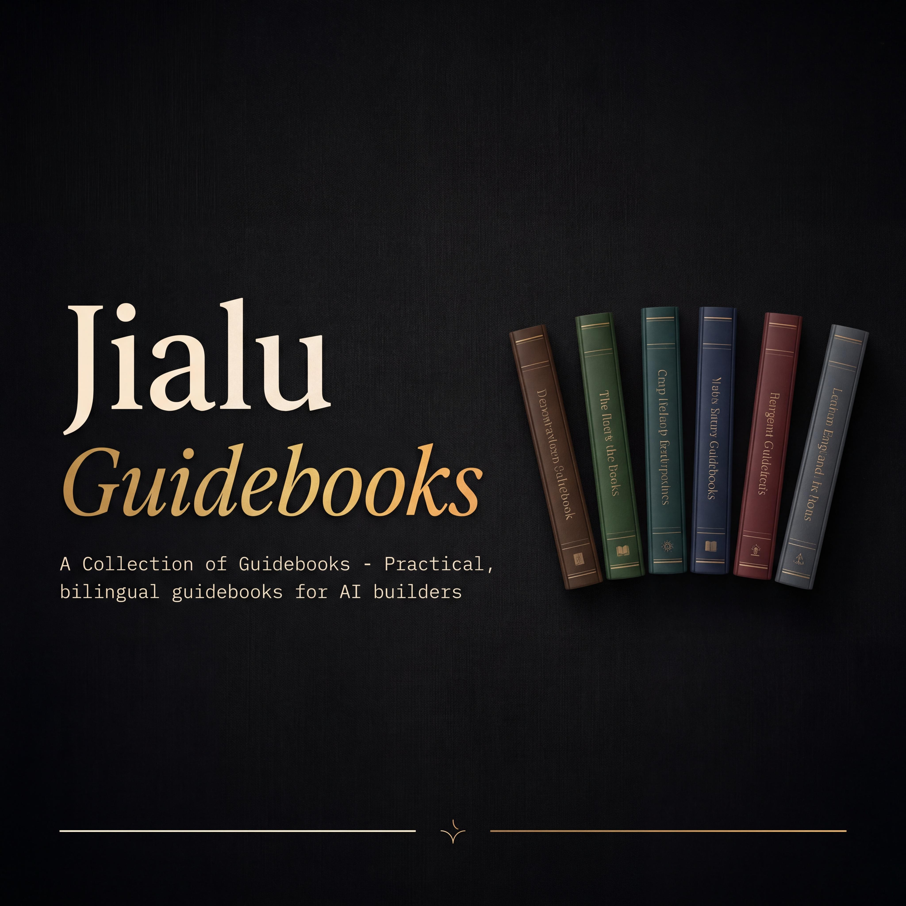

<p align="center">
  
</p>

<h1 align="center">📚 Jialu Guidebooks · 佳路写的指南全集</h1>

<p align="center">
  <strong>面向 AI 实践者的双语实战指南 —— 从入门到精通。</strong>
</p>

<p align="center">
  <a href="README.md">🇺🇸 English</a> •
  <a href="#-指南目录">目录</a> •
  <a href="#-内容特色">特色</a> •
  <a href="#-如何使用">使用方式</a> •
  <a href="#-最新更新">更新</a> •
  <a href="https://x.com/Xialu8888">在 X 上关注我</a>
</p>

<p align="center">
  
  
  
  
  
</p>

---

## 👋 关于这个仓库

我是佳路 —— 我专注撰写 **深度、实战导向的 AI 工具与框架指南**。每本指南都提供 **中文和英文** 双语版本，带你从基础原理走到生产级实战。

这个仓库是我所有已发布指南的唯一官方来源。如果你从 X（@Xialu8888）或者微信公众号“探微观智”上看到链接来到这里，欢迎！你来对地方了。

> **新指南持续更新中。** 点击 ⭐ Star 关注最新动态。

---

## 📖 指南目录

每本指南在 `guides/` 目录下有独立文件夹，包含 `zh-CN`（中文）和 `en`（英文）两个子目录。

| # | 指南名称 | 主题 | 中文 🇨🇳 | English 🇺🇸 |
|---|---------|------|----------|------------|
| 1 | **AI短剧从入门到精通** | AI 驱动短剧制作 | [中文](guides/ai-short-drama/zh-CN/) | [English](guides/ai-short-drama/en/) |
| 2 | **DeerFlow 2.0 从入门到精通** | 深度研究 Agent 框架 | [中文](guides/deerflow-2.0/zh-CN/) | [English](guides/deerflow-2.0/en/) |
| 3 | **多 Agent 架构从入门到精通** | 构建多智能体系统 | [中文](guides/multi-agent-architecture/zh-CN/) | [English](guides/multi-agent-architecture/en/) |
| 4 | **Coze 从入门到精通** | Coze 平台深度实战 | [中文](guides/coze/zh-CN/) | [English](guides/coze/en/) |
| 5 | **AI 分身从入门到精通** | 数字分身与 AI 克隆 | [中文](guides/ai-avatar/zh-CN/) | [English](guides/ai-avatar/en/) |
| 6 | **AI Native 组织从入门到精通** | AI 原生团队运营 | [中文](guides/ai-native-organization/zh-CN/) | [English](guides/ai-native-organization/en/) |

> 💡 **更多指南即将发布。** 查看 [更新日志](CHANGELOG.md) 了解最新动态。

---

## 🎯 内容特色

每本指南遵循统一的结构：

```
📘 从入门到精通
├── 第一部分：基础篇 —— 是什么、为什么重要
├── 第二部分：核心概念 —— 思维模型与架构
├── 第三部分：实战篇 —— 手把手教程
├── 第四部分：进阶篇 —— 生产技巧、边界场景、优化
└── 第五部分：资源篇 —— 工具、链接、社区
```

**这些指南有什么不同：**
- **天生双语** —— 每本指南同时提供中文和英文版
- **实战导向** —— 为做事的人写，不是为读书的人写
- **经过验证** —— 基于真实项目和生产经验
- **持续更新** —— 随工具和最佳实践的演进不断迭代

---

## 🚀 如何使用

**方式 1：在 GitHub 上直接阅读**
点击上方 [目录表格](#-指南目录) 中的链接即可在线阅读。

**方式 2：克隆到本地**
```bash
git clone https://github.com/chengjialu8888/Jialu-Guidebooks.git
```

**方式 3：下载单本指南**
进入对应指南文件夹，下载所需文件即可。

---

## 🆕 最新更新

| 日期 | 更新内容 |
|------|---------|
| 2026-04 | 🎉 仓库上线，首批 6 本指南发布 |

> 完整历史见 [CHANGELOG.md](CHANGELOG.md)

---

## 🗂️ 仓库结构

```
Jialu-Guidebooks/
├── README.md              ← English 入口
├── README_CN.md           ← 你在这里（中文版）
├── guides/
│   ├── ai-short-drama/
│   │   ├── zh-CN/         ← 中文版
│   │   └── en/            ← English version
│   ├── deerflow-2.0/
│   ├── multi-agent-architecture/
│   ├── coze/
│   ├── ai-avatar/
│   └── ai-native-organization/
├── assets/                ← Banner、封面图、图片
└── CHANGELOG.md
```

**添加新指南？** 只需在 `guides/` 下创建新文件夹，包含 `zh-CN/` 和 `en/` 子目录即可。

---

## 🤝 参与贡献

发现错别字？想改进翻译？欢迎贡献！

- **Issues** —— 通过 [GitHub Issues](https://github.com/chengjialu8888/Jialu-Guidebooks/issues) 反馈错误或建议主题
- **Pull Requests** —— 修复错别字、改进翻译、优化排版
- **主题建议** —— 想看某个 AI 主题的指南？开个 Issue 告诉我！

详见 [CONTRIBUTING.md](CONTRIBUTING.md)。

---

## 📬 保持联系

- **X（推特）：** [@Xialu8888](https://x.com/Xialu8888)
- **公众号：** 探微观智 —— 我会在这里分享预告和洞察
- **给这个仓库点 Star** ⭐ 第一时间收到新指南通知

---

## 📄 许可协议

本作品采用 [知识共享署名-非商业性使用-相同方式共享 4.0 国际许可协议 (CC BY-NC-SA 4.0)](https://creativecommons.org/licenses/by-nc-sa/4.0/) 进行许可。

你可以自由分享和改编这些材料（非商业用途），但需注明出处。

---

<p align="center">
  <sub>用 ❤️ 构建 by <a href="https://x.com/Xialu8888">佳路</a> · 如果这些指南对你有帮助，一个 ⭐ 就是最好的支持</sub>
</p>
